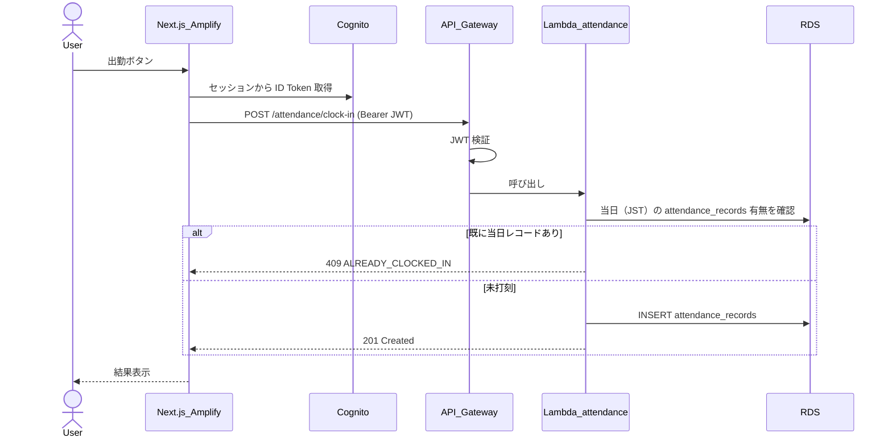
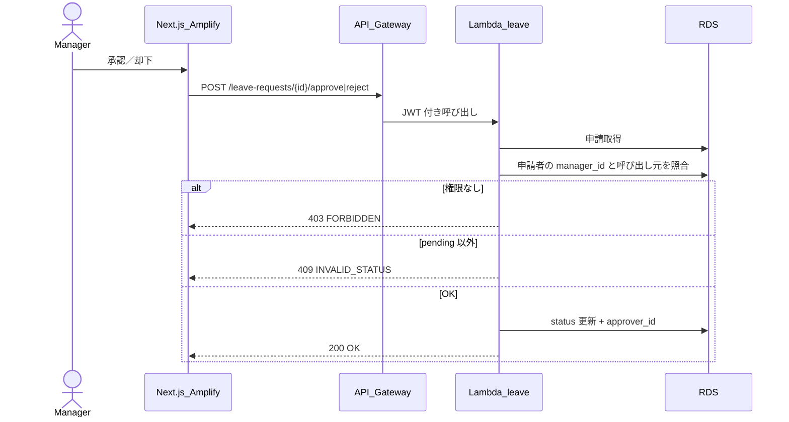
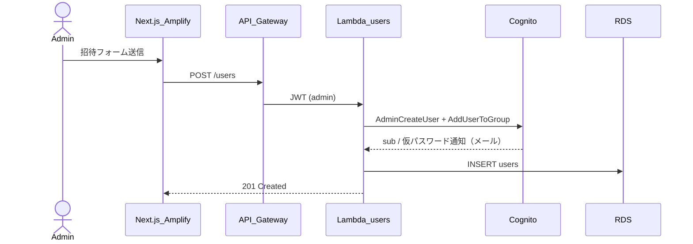
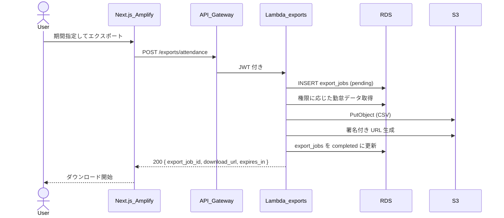

# シーケンス図

## 1. 出勤打刻

```mermaid
sequenceDiagram
  actor User
  participant Web as Next.js_Amplify
  participant Cognito
  participant APIGW as API_Gateway
  participant Lambda as Lambda_attendance
  participant RDS

  User->>Web: 出勤ボタン
  Web->>Cognito: セッションから ID Token 取得
  Web->>APIGW: POST /attendance/clock-in (Bearer JWT)
  APIGW->>APIGW: JWT 検証
  APIGW->>Lambda: 呼び出し
  Lambda->>RDS: 当日（JST）の attendance_records 有無を確認
  alt 既に当日レコードあり
    Lambda-->>Web: 409 ALREADY_CLOCKED_IN
  else 未打刻
    Lambda->>RDS: INSERT attendance_records
    Lambda-->>Web: 201 Created
  end
  Web-->>User: 結果表示
```

## 2. 休暇承認

```mermaid
sequenceDiagram
  actor Manager
  participant Web as Next.js_Amplify
  participant APIGW as API_Gateway
  participant Lambda as Lambda_leave
  participant RDS

  Manager->>Web: 承認／却下
  Web->>APIGW: POST /leave-requests/{id}/approve|reject
  APIGW->>Lambda: JWT 付き呼び出し
  Lambda->>RDS: 申請取得
  Lambda->>RDS: 申請者の manager_id と呼び出し元を照合
  alt 権限なし
    Lambda-->>Web: 403 FORBIDDEN
  else pending 以外
    Lambda-->>Web: 409 INVALID_STATUS
  else OK
    Lambda->>RDS: status 更新 + approver_id
    Lambda-->>Web: 200 OK
  end
```

## 3. ユーザー招待

```mermaid
sequenceDiagram
  actor Admin
  participant Web as Next.js_Amplify
  participant APIGW as API_Gateway
  participant Lambda as Lambda_users
  participant Cognito
  participant RDS

  Admin->>Web: 招待フォーム送信
  Web->>APIGW: POST /users
  APIGW->>Lambda: JWT (admin)
  Lambda->>Cognito: AdminCreateUser + AddUserToGroup
  Cognito-->>Lambda: sub / 仮パスワード通知（メール）
  Lambda->>RDS: INSERT users
  Lambda-->>Web: 201 Created
```

## 4. CSV エクスポート

```mermaid
sequenceDiagram
  actor User
  participant Web as Next.js_Amplify
  participant APIGW as API_Gateway
  participant Lambda as Lambda_exports
  participant RDS
  participant S3

  User->>Web: 期間指定してエクスポート
  Web->>APIGW: POST /exports/attendance
  APIGW->>Lambda: JWT 付き
  Lambda->>RDS: INSERT export_jobs (pending)
  Lambda->>RDS: 権限に応じた勤怠データ取得
  Lambda->>S3: PutObject (CSV)
  Lambda->>S3: 署名付き URL 生成
  Lambda->>RDS: export_jobs を completed に更新
  Lambda-->>Web: 200 { export_job_id, download_url, expires_in }
  Web-->>User: ダウンロード開始
```
