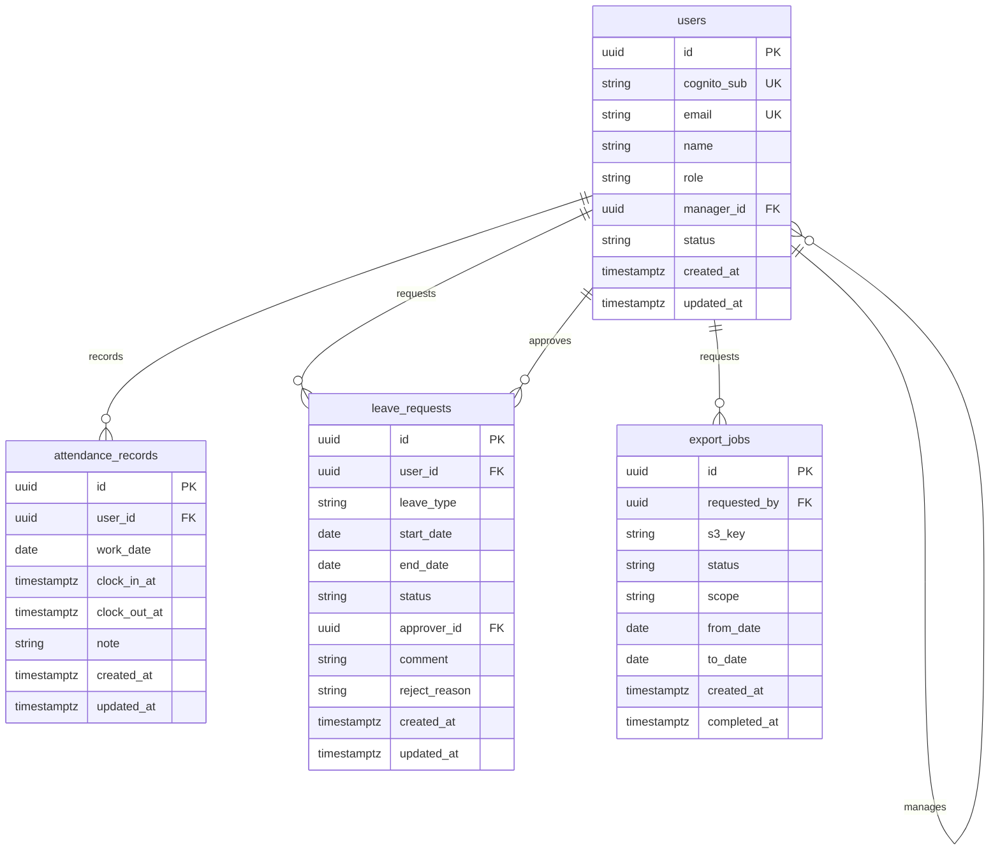

# ER図 — 勤怠管理アプリ

## 概要

PostgreSQL（RDS）上の論理モデル。タイムスタンプは UTC 保存、表示・業務判定は `Asia/Tokyo`。

## エンティティ関係図

## テーブル定義

### users

| カラム | 型 | 制約 | 説明 |
|--------|-----|------|------|
| id | UUID | PK | アプリ内部 ID |
| cognito_sub | VARCHAR(64) | UNIQUE NOT NULL | Cognito `sub` |
| email | VARCHAR(255) | UNIQUE NOT NULL | ログインメール |
| name | VARCHAR(120) | NOT NULL | 表示名 |
| role | VARCHAR(20) | NOT NULL | `employee` / `manager` / `admin` |
| manager_id | UUID | FK → users.id NULL可 | 上長（1段） |
| status | VARCHAR(20) | NOT NULL | `active` / `disabled` |
| created_at / updated_at | TIMESTAMPTZ | NOT NULL | 監査用 |

### attendance_records

| カラム | 型 | 制約 | 説明 |
|--------|-----|------|------|
| id | UUID | PK | |
| user_id | UUID | FK NOT NULL | |
| work_date | DATE | NOT NULL | JST の勤務日 |
| clock_in_at | TIMESTAMPTZ | NOT NULL | |
| clock_out_at | TIMESTAMPTZ | NULL可 | 未退勤時 NULL |
| note | VARCHAR(500) | NULL可 | |
| UNIQUE | (user_id, work_date) | | 1 日 1 レコード |

### leave_requests

| カラム | 型 | 制約 | 説明 |
|--------|-----|------|------|
| id | UUID | PK | |
| user_id | UUID | FK NOT NULL | 申請者 |
| leave_type | VARCHAR(20) | NOT NULL | `paid` / `absence` / `other` |
| start_date / end_date | DATE | NOT NULL | 期間（両端含む） |
| status | VARCHAR(20) | NOT NULL | `pending` / `approved` / `rejected` |
| approver_id | UUID | FK NULL可 | 承認／却下した人 |
| comment | TEXT | NULL可 | 申請理由 |
| reject_reason | TEXT | NULL可 | 却下理由 |

### export_jobs

| カラム | 型 | 制約 | 説明 |
|--------|-----|------|------|
| id | UUID | PK | |
| requested_by | UUID | FK NOT NULL | |
| s3_key | VARCHAR(512) | NULL可 | 完了後に設定 |
| status | VARCHAR(20) | NOT NULL | `pending` / `completed` / `failed` |
| scope | VARCHAR(20) | NOT NULL | `self` / `team` / `all` |
| from_date / to_date | DATE | NOT NULL | 対象期間 |

## インデックス（推奨）

- `attendance_records (user_id, work_date)`
- `leave_requests (user_id, status)` — 申請者自身の一覧、および配下ユーザー ID 集合に対する pending 抽出
- `users (manager_id)` — 上長から配下メンバーを引く（承認待ち・配下勤怠の起点）

補足: 承認待ちは「`users.manager_id = 呼び出し元` のユーザーが申請した `leave_requests.status = pending`」で引く。`approver_id` は承認／却下**後**に埋まるため、承認待ち検索の主キーには使わない。
