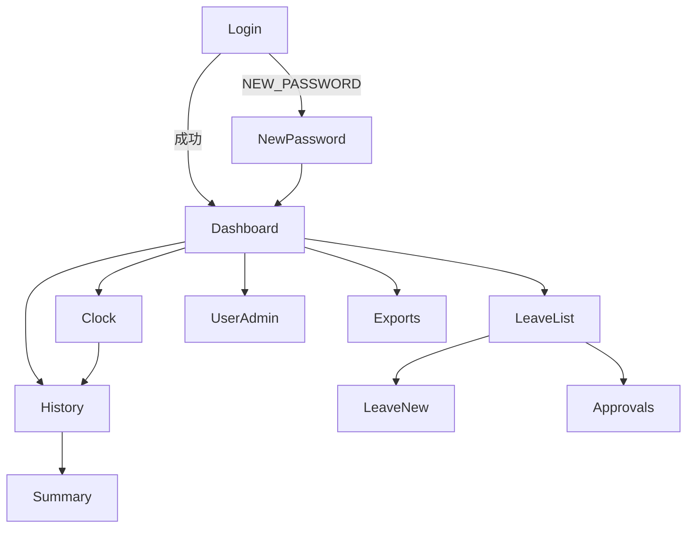

# 画面一覧・画面遷移

## 画面一覧

| ID | 画面名 | パス（案） | ロール | 概要 |
|----|--------|------------|--------|------|
| S01 | ログイン | `/login` | 未認証 | メール／パスワード。初回は仮パスワード変更へ |
| S02 | 仮パスワード変更 | `/login/new-password` | 要チャレンジ | Cognito NEW_PASSWORD_REQUIRED |
| S03 | ダッシュボード | `/` | 全ロール | 本日の打刻状態、承認待ち件数（manager/admin） |
| S04 | 打刻 | `/attendance` | 全ロール | 出勤／退勤ボタン、当日ステータス |
| S05 | 打刻履歴 | `/attendance/history` | 全ロール | 月選択・一覧・勤務時間 |
| S06 | 月次サマリ | `/attendance/summary` | 全ロール | 月の合計勤務時間 |
| S07 | 休暇申請一覧 | `/leave` | 全ロール | 自身の申請一覧（manager は配下の pending も） |
| S08 | 休暇申請作成 | `/leave/new` | 全ロール | 種別・期間・理由 |
| S09 | 休暇承認 | `/leave/approvals` | manager, admin | 承認／却下 |
| S10 | ユーザー管理 | `/admin/users` | admin | 一覧・招待・無効化・ロール／上長変更 |
| S11 | エクスポート | `/exports` | 全ロール（範囲は権限依存） | 期間指定 → CSV ダウンロード |

## 画面遷移

## 主要 UI 要件（簡易）

- 認証必須ページは未ログイン時 `/login` へリダイレクト
- ロール外ページは 403 相当の案内を表示
- 打刻画面は「出勤」「退勤」を状態に応じて活性化／非活性化
- エクスポート完了後は署名付き URL を新しいタブまたはダウンロードで開く（URL は画面に長時間表示しない）

## ワイヤー方針

学習用 MVP のため、詳細なビジュアルデザインシステムは持たない。Next.js で機能優先のシンプルなレイアウト（ヘッダーナビ ＋ メイン）とする。
