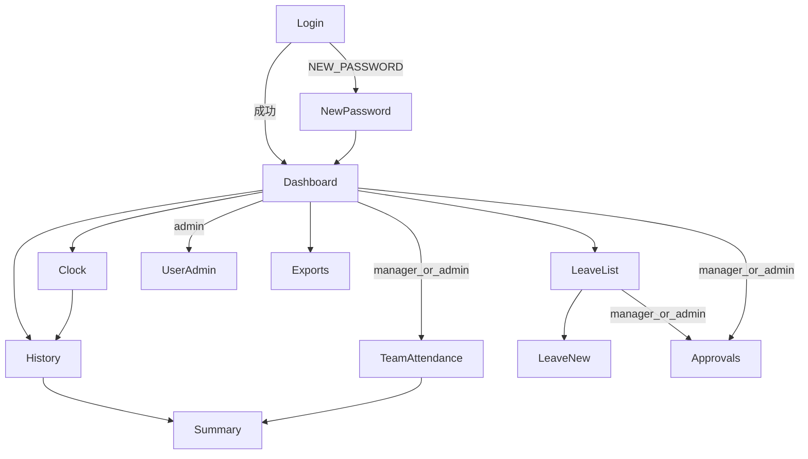

# 画面一覧・画面遷移

## 画面一覧

| ID | 画面名 | パス（案） | ロール | 概要 |
|----|--------|------------|--------|------|
| S01 | ログイン | `/login` | 未認証 | メール／パスワード。初回は仮パスワード変更へ |
| S02 | 仮パスワード変更 | `/login/new-password` | 要チャレンジ | Cognito NEW_PASSWORD_REQUIRED |
| S03 | ダッシュボード | `/` | 全ロール | 本日の打刻状態、承認待ち件数（manager/admin） |
| S04 | 打刻 | `/attendance` | 全ロール | 出勤／退勤ボタン、当日ステータス |
| S05 | 打刻履歴 | `/attendance/history` | 全ロール | 本人履歴。API 正本は `GET /attendance/records?scope=self`（`/attendance/me` はエイリアス） |
| S06 | 月次サマリ | `/attendance/summary` | 全ロール | `GET /attendance/summary`。本人は `user_id` なし。S07 から配下を選ぶと `user_id` 付き |
| S07 | 配下勤怠 | `/attendance/team` | manager, admin | 配下／全体の履歴（`GET /attendance/records?scope=team\|all`）。行から S06 へ遷移してサマリ表示 |
| S08 | 休暇申請一覧 | `/leave` | 全ロール | 自身の申請一覧（`GET /leave-requests?scope=self`） |
| S09 | 休暇申請作成 | `/leave/new` | 全ロール | 種別・期間・理由 |
| S10 | 休暇承認 | `/leave/approvals` | manager, admin | `GET /leave-requests?scope=team\|all&status=pending` を表示し、承認／却下 |
| S11 | ユーザー管理 | `/admin/users` | admin | 一覧・招待・無効化・ロール／上長変更 |
| S12 | エクスポート | `/exports` | 全ロール（範囲は権限依存） | 期間指定 → `POST /exports/attendance` → 署名付き URL で CSV ダウンロード |

## 画面遷移

## 主要 UI 要件（簡易）

- 認証必須ページは未ログイン時 `/login` へリダイレクト
- ロール外ページは 403 相当の案内を表示（S07 / S10 / S11 はロールで非表示または拒否）
- 打刻画面は「出勤」「退勤」を状態に応じて活性化／非活性化
- エクスポート完了後は署名付き URL を新しいタブまたはダウンロードで開く（URL は画面に長時間表示しない）

## ワイヤー方針

学習用 MVP のため、詳細なビジュアルデザインシステムは持たない。Next.js で機能優先のシンプルなレイアウト（ヘッダーナビ ＋ メイン）とする。
